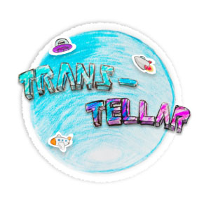
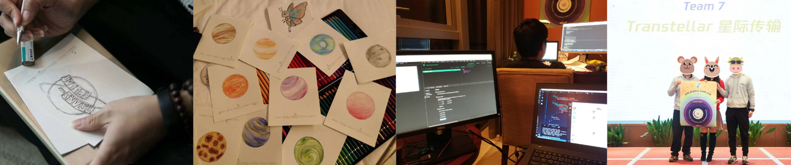

# :rocket: :new_moon_with_face: Transtellar

</img>

The game work of [Global Game Jame 2018](https://globalgamejam.org/2018) (Theme: [transmission](https://globalgamejam.org/theme-2018))

Our team has 3 people, they are: Qing Li, [@grissom](https://github.com/luckscx) and I. Developed from scratch
within 40hrs.

## Online demo

</img>

You can also serve this repo as static website and open `/index.html` to play.

## Game play

The goal is to transmit a piece of info between stars, as far as you can. you only need to take care of **2** things:

* Use the universal language between these stars: gestures, 8 direction swipe and single tap. You need to finish the gestures provided to enable a transmit.

* Make sure the two aircrafts of each transmission is close enough so the signal won't be lost.

Your time is limited, with each successful transmission, you will get 10s bonus, whereas a 10s penalty for wrong gestures. Also there is a hard mode, each gesture is mapped to an alien character, it's a big challenge for your memory.

## How it is made

### Behind the scene

</img>
  
 

Without dedicated artist persion, our team basiclly made up of programmer and product designer. And due to some schedule reasons, Qin Li and I only got time to work on this 9hrs after the theme was announced.

Thankfully we got colored pencils and paper, and because of that, we figured out that we can draw by hand instead of mouse, and take pictures using a cell phone to turn these drawings as game asset. So we were able to finish the main develop process about 1 hour before the deadline:sunglasses:.

### Made with

* Phaser.js
* Vue.js for fast UI construction
* Colored pencil, paper & :camera: for art
* :heart:
